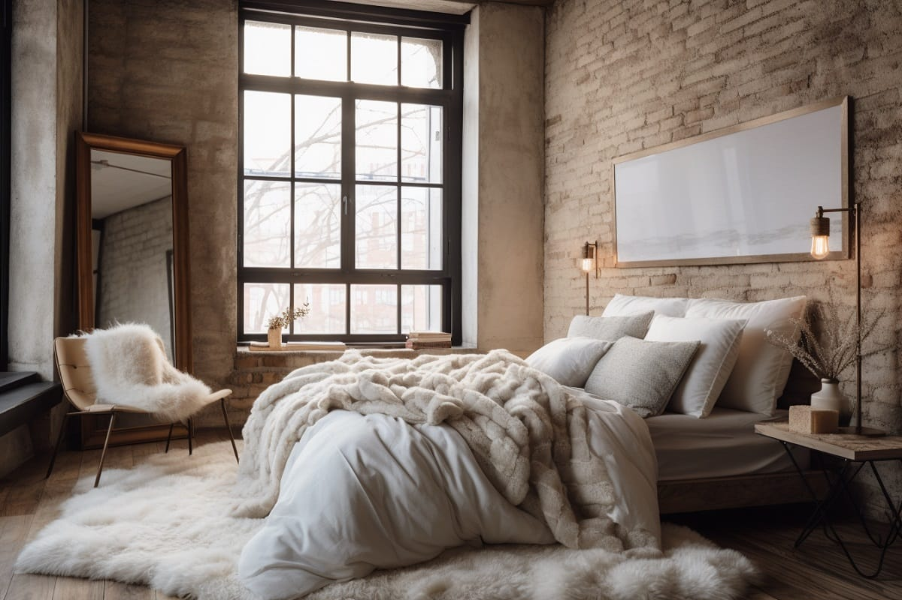
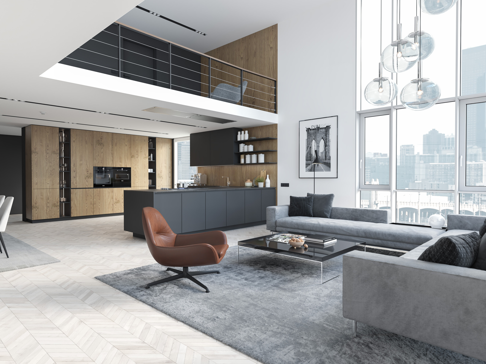

# Commands

```
conda install --yes -c pytorch pytorch torchvision cudatoolkit=11.0
pip install ftfy regex tqdm
pip3 install git+https://github.com/openai/CLIP.git
```

# Example



```
Furniture Predictions:
a bed: 0.9699
a wardrobe: 0.0114
a table: 0.0035
a curtain: 0.0031
a picture frame: 0.0024
a bookshelf: 0.0018
a mirror: 0.0015
a dresser: 0.0015
a nightstand: 0.0011
a rug: 0.0008
a desk: 0.0006
a cushion: 0.0006
a chair: 0.0005
a sofa: 0.0003
a carpet: 0.0003
a coffee table: 0.0003
a lamp: 0.0001
a cabinet: 0.0001
a plant: 0.0001

Style Predictions:
cozy: 0.5807
luxurious: 0.1142
warm: 0.1004
chic: 0.0988
rustic: 0.0581
artistic: 0.0133
romantic: 0.0087
modern: 0.0075
casual: 0.0060
vintage: 0.0041
neutral: 0.0039
minimalist: 0.0018
bohemian: 0.0015
elegant: 0.0004
industrial: 0.0002
wooden: 0.0001
dark: 0.0001
bright: 0.0001
traditional: 0.0001
functional: 0.0000
colorful: 0.0000

Top 5 Furniture Predictions:
a bed: 0.9699
a wardrobe: 0.0114
a table: 0.0035
a curtain: 0.0031
a picture frame: 0.0024

Top 5 Style Predictions:
cozy: 0.5807
luxurious: 0.1142
warm: 0.1004
chic: 0.0988
rustic: 0.0581
```



```
(base) yangjin@Ryzen-5600X:/mnt/c/Users/ChoYangJin/Desktop/workspace/CSC4018-prototype/clip_poc$ python3 main.py
Furniture Predictions:
a desk: 0.4256
a table: 0.2397
a coffee table: 0.1515
a chair: 0.0616
a bookshelf: 0.0247
a sofa: 0.0245
a rug: 0.0224
a bed: 0.0156
a cabinet: 0.0112
a carpet: 0.0072
a wardrobe: 0.0053
a mirror: 0.0036
a lamp: 0.0023
a dresser: 0.0017
a picture frame: 0.0013
a cushion: 0.0007
a curtain: 0.0005
a plant: 0.0005
a nightstand: 0.0002

Style Predictions:
modern: 0.7903
luxurious: 0.1147
chic: 0.0715
artistic: 0.0074
neutral: 0.0044
industrial: 0.0033
rustic: 0.0018
casual: 0.0017
minimalist: 0.0013
elegant: 0.0012
warm: 0.0005
dark: 0.0004
cozy: 0.0003
romantic: 0.0003
bohemian: 0.0003
vintage: 0.0002
wooden: 0.0002
traditional: 0.0002
bright: 0.0002
functional: 0.0001
colorful: 0.0000

Top 5 Furniture Predictions:
a desk: 0.4256
a table: 0.2397
a coffee table: 0.1515
a chair: 0.0616
a bookshelf: 0.0247

Top 5 Style Predictions:
modern: 0.7903
luxurious: 0.1147
chic: 0.0715
artistic: 0.0074
neutral: 0.0044
```
